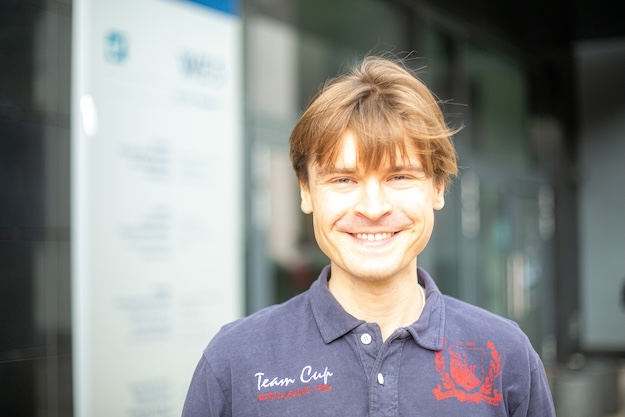
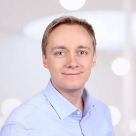
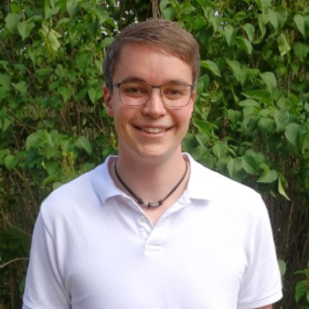
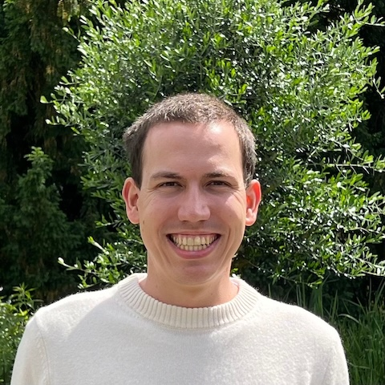
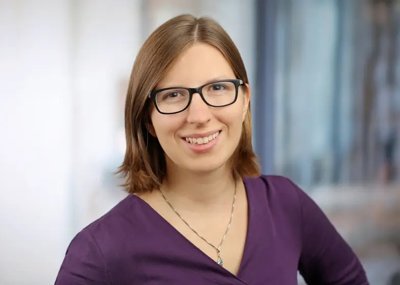
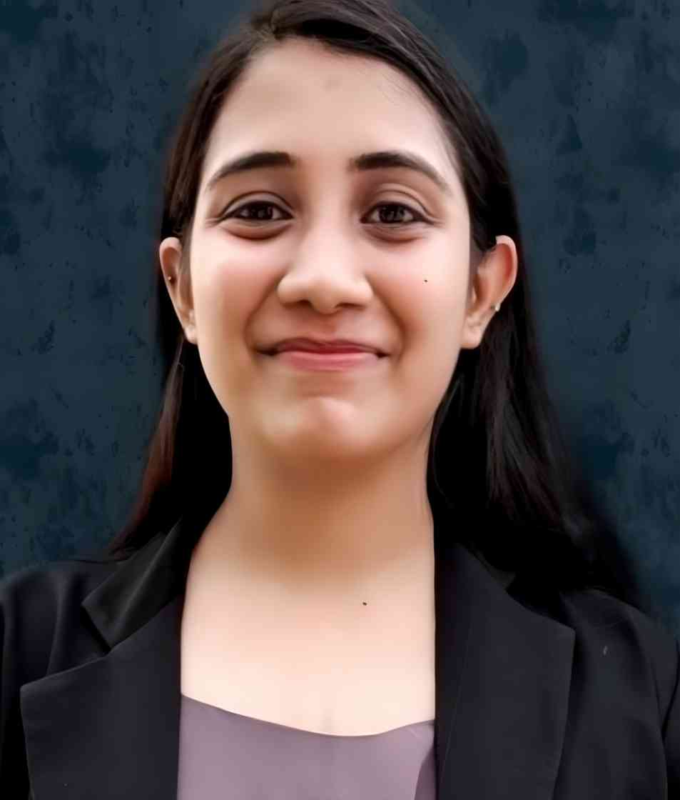
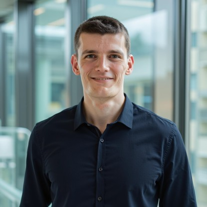

# Second Workshop on ML4Sys and Sys4ML

## Organization 

### Workshop Chairs and Selection Committee
* Manisha Luthra (TU Darmstadt & DFKI)
* Andreas Kipf (University of Technology Nuremberg)
* Matthias Böhm (TU Berlin & BIFOLD)

## Program

| Time        |  | Speaker                                      | Title                                            |
|------------|-------|----------------------------------------------|--------------------------------------------------|
| 09:00 - 09:20 |      | Matthias and Andreas            | Opening Remarks                                    |

### Systems for ML (Matthias)

| Time        |  | Speaker                                      | Title                                            |
|------------|-------|----------------------------------------------|--------------------------------------------------|
| 09:20 - 09:40 |  | Maximilian Schüle (Uni Bamberg) | Blue Elephants Inspecting Pandas: Inspection and Execution of Machine Learning Pipelines in SQL |
| 09:40 - 10:00 |  | Maximilian Böther (ETH Zurich) | Modyn: Data-Centric Machine Learning Pipeline Orchestration |
| 10:00 - 10:30 |  | Stefan Grafberger (TU Berlin) | mlwhatif: Data-Centric What-If Analysis for Native Machine Learning Pipelines |

### Coffee Break

### Applications & Benchmarks (Matthias)

| Time        |  | Speaker                                      | Title                                            |
|------------|-------|----------------------------------------------|--------------------------------------------------|
| 11:00 - 11:20 |   | Stefan Hagedorn, Steffen Kläbe (Actian)   | Experiences of Implementing In-Database TPCx-AI |
| 11:20 - 11:50 |  | Thaleia-Dimitra Doudali (IMDEA) | Keep it Simple, Sustainable! When Is ML Necessary in Cloud Resource Management? |
| 11:50 - 12:10 |  | Jan-Micha Bodensohn, Liane Vogel (TU Darmstadt & DFKI) | Large Language Models for Enterprise Data Engineering |
| 12:10 - 12:30 |  | Akanksha Vijayvergiya (Uni Passau) | Time-Series Analysis for Life-Science Data |

### Lunch Break

### ML for Systems (Andreas)

| Time        |  | Speaker                                      | Title                                            |
|------------|-------|----------------------------------------------|--------------------------------------------------|
| 13:15 - 13:45 |  | Silvan Reiner (Uni Konstanz) | ML4DB: Don’t Learn What You Already Know |
| 13:45 - 14:05 |  | Johannes Wehrstein (TU Darmstadt) | GRACEFUL: A Learned Cost Estimator For UDFs |
| 14:05 - 14:35 |  | Giorgio Vinciguerra (Uni Pisa) | Learned Compression of Nonlinear Time Series With Random Access |
| 14:35 - 15:05 |  | Immanuel Trummer (Cornell) | CheaPT: Using Language Models Without Breaking the Bank |

## Workshop Description

The rapid advances in machine learning (ML) have significantly increased its adoption across various fields including data systems, both in academia and industry. These advancements have not only enhanced existing data systems but, in some cases, have completely transformed their internal components, leading to the development of an important field of “learned data system components” in the ML for Systems area. Similarly, a well-structured systems approach has also played a crucial role in advancing current ML techniques and systems, forming the basis for the Systems for the ML area.

The workshop aims to bring together renowned researchers both by means of keynotes and invited talks to discuss and debate intriguing topics at the core of the two focus areas. The open format for submitting abstracts from anything like a position paper to technical experiences allows for lively debates and discussions as well as fosters collaborations among participants to work on common topics. The speakers are expected to also share insights into their ongoing projects and the open research challenges they are currently addressing. 

**A key objective of this workshop is to promote interaction between all attendees—whether they are presenting authors, keynote or invited speakers, or other participants—to foster new collaborations.**

## Call for Abstracts

This year in the ML4Sys and Sys4ML workshop we are calling for **one-page abstract** submissions that can be anything from a position paper representing a novel vision about a viewpoint or a controversial topic, a summary of lessons learned by working on a research area, an open research problem, or technical experience working on a large system (academic or industry). The requirements for the abstracts is as follows 

- a one-page abstract on an exciting research or industry problem for the submission, and
- a short summary about the author (short bio) including corresponding work done related to the problem. Links to the author’s homepage and/or LinkedIn can be also included.

Please use the submission instructions of the main conference, LNI style (see https://gi.de/service/publikationen/lni) for the abstract. 
Additionally, you can submit a 2-minute video about the position paper, e.g., by demonstration or including a presentation about their work. Instead of a video, a maximum of 3 slides explaining the idea can also be submitted.

### Topics of Interest 

- ML for Systems
  * Learned query processing and optimization
  * Learned index structures and storage layouts
  * Learned algorithms for sorting, compressing, and encoding data
  * Learned data exploration, discovery, and integration
  * Self-tuning and instance-optimized database systems
  * Learned data systems on emerging hardware and cloud platforms
  * New datasets, benchmarks, and evaluation methods for learned databases
  * Novel use of ML techniques in big data applications
  * Novel use of natural language models and interfaces in data management
  * Building and managing large-scale knowledge bases
    
- Systems for ML
  * Data and model management in ML applications and complex ML pipelines
  * Data integration, alignment, and preparation of multi-modal training datasets
  * Data cleaning/debugging techniques and data quality management
  * Data augmentation techniques, pipelines, and algorithm integration
  * Data flow optimizations in ML systems (e.g., rewrites, operator fusion)
  * Data- and task-parallel execution strategies for ML pipelines
  * Data access methods in ML systems (e.g., indexing, compression, partitioning)
  * New data system infrastructures and tools for applied ML

### Submission Timeline 
- **Abstract submission: ~~December 3rd, 2024~~ December 15th, 2024 (11:59 pm CET)**
- **Notification on acceptance: ~~December 17th, 2024~~ January, 10th, 2025**
- **Workshop dates: March 4th, 2025**

**Where to submit: [Submission Form](https://forms.gle/e5ZYQ6P7THg6xF9F8)**

**In case of questions, contact us at mlsystemsworkshop.btw@gmail.com**